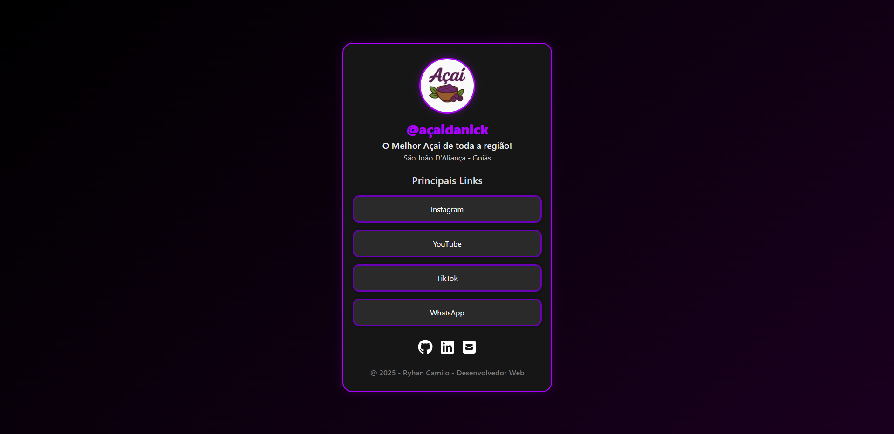

# 🌐 Link na Bio - Ryhan

Uma página moderna e responsiva estilo *Linktree*, criada em **HTML e CSS puro**, com design personalizado para o perfil **@açaidanick**.
O objetivo é centralizar todos os links importantes em um só lugar, com um visual elegante e otimizado para celulares, tablets e desktops.

---

## 🖥️ Demonstração do Site
🔗 [Acesse o projeto aqui](https://ryhzera.github.io/bio-links-ryhan/)  

---

## 📸 Previa do Projeto


---

## 🚀 Tecnologias Utilizadas

- **HTML5** → estrutura da página  
- **CSS3** → estilização e responsividade  
- **Flexbox** e **Media Queries** → adaptação para qualquer tela  
- **Gradientes** e **efeitos hover** → visual moderno e interativo  

---

## 🎨 Destaques do Projeto

✅ Layout totalmente responsivo (celulares, tablets e PCs)  
✅ Design escuro com destaque roxo (#ae00ff)  
✅ Animações suaves nos botões e ícones  
✅ Ícones sociais com efeito luminoso  
✅ Estrutura leve, limpa e de fácil manutenção  

---

```bash
📁 Estrutura de pastas
├── index.html
├── style.css
├── /img
│ └── logofundo.png
├── /icon
│ ├── github.svg
│ ├── linkedin.svg
│ └── mail.svg
```

---

## 💡 Como executar o projeto localmente

1. Clone este repositório:
   ```bash
   git clone https://github.com/RyhZera/bio-links-ryhan.git
   ````
2. Abra o arquivo **index.html** no navegador.
---

## 👨‍💻 Autor

Ryhan Camilo Campos

Desenvolvedor Front-End

Formosa - Goiás

Contato: https://www.linkedin.com/in/ryhan-camilo-campos-b9979b398/

---
🪪 Licença

Este projeto está sob a licença MIT.
